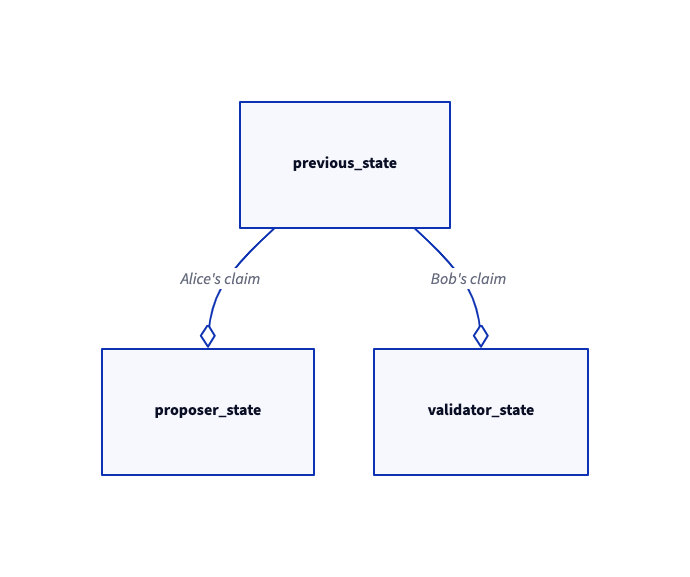

# Determinism 🤝 Rollups

[Determinism](https://en.wikipedia.org/wiki/Deterministic_system#In_computer_science) is crucial for rollups because of [fault proof](https://community.optimism.io/docs/protocol/2-rollup-protocol/#fault-proofs). Validators will execute program([Turing machine](https://en.wikipedia.org/wiki/Turing_machine) tape) to validate the proposed state of rollup, syncing shared [repliced state machine](https://en.wikipedia.org/wiki/State_machine_replication). The state machine consists of a transition function. The transition function must be deterministic to decide which party is correct when dispute occur. For example, let's say that Alice is the state proposer and Bob is a validator. Bob will advance its own machine state by validating the program, and checks the sanity of proposed state at L1 and disagrees with it, and tells L1 that Alice has lied, triggering fault proof. If the program is nondeterministic, L1 will never find out who's claim(state) is right, leading L1 security inheritance loss.

  

Note that determinism is only required when validating. When sequencer executes transactions(not validating), determinism of the entire program is not required. EVM state machine will provide necessary determinism for execution. For example, let's say that the sequencer uses [geth](https://github.com/ethereum/go-ethereum)'s EVM implementation for transaction execution. Even if geth program is nondeterministic because of parallelism(multiprocessing + goroutines), EVM state machine will still be deterministic. When validating, since required logic for validation is a part of execution program, the required logic can be taken care for guaranteeing determinism, such as compiling down to [Wasm](https://en.wikipedia.org/wiki/WebAssembly) or [MIPS](https://en.wikipedia.org/wiki/MIPS_architecture). 

Every validator must share identical virtual machine structure for supporting determinism. If not, nondeterminism will sneak in. For example, Alice is validating MIPS program using virtual machine where pipelining is disabled. Bob is validating using actual MIPS chip which pipelining is enabled. Intermediate state may be different due to discrepancy of validation machine.

There are multiple causes which introduces nondeterminism, such as parallelism, concurrency, virtual machine difference and even instruction level nondeterminism. We need to dodge this issues while validating(proving), making the proved program be deterministic. Let's observe how the two big rollup giants: [Arbitrum](https://arbitrum.io/) and [Optimism](https://www.optimism.io/), managed to overcome nondeterminism and handled side effects. After that, we will discuss food for thought topics related with determinism.

## Case Study

### [Optimism Cannon](https://github.com/ethereum-optimism/cannon)

Currently(23Q1) there is [no fault proof](https://community.optimism.io/docs/security-model/optimism-security-model/#does-optimism-have-fault-proofs) in Optimism. The Optimism team disabled previous [fault proof mechanism](https://research.paradigm.xyz/optimism) which was based on OVM, and are preparing next gen fault proofs, [Cannon](https://medium.com/ethereum-optimism/cannon-cannon-cannon-introducing-cannon-4ce0d9245a03). Cannon is a proof-of-concept fault prover, and not yet integrated to Optimism nor in production.

Although the code is not production ready, it is worth to inspect how cannon handled determinism. Cannon validates [minigeth](https://github.com/ethereum-optimism/minigeth/tree/c2b6152b4afb05e07514ad892304c117b2f72134), which is stripped down version of geth. The program checks that EVM state transition is correct by block unit, generating next block from previous block by executing transactions included in next block. It does not care about checking whether calldata decompression is correct or not. The implementation is a PoC, minimal working example of fault prover.

For determinism, minigeth is compiled down to [MIPS](https://en.wikipedia.org/wiki/MIPS_architecture)(32 bit memory space) using golang compiler and [mipigo](https://github.com/ethereum-optimism/cannon/tree/master/mipigo), and validated in single threaded virtual machine. 

Below are the key aspects to check for determinism in Cannon. 

There is no parallelism due to no multiprocessing(MIPS virtual machine is implemented in single core).

MIPS pipelining does not bring nondeterminism. Multi-stage MIPS pipeline is equivalent to [finite state machines](https://en.wikipedia.org/wiki/Finite-state_machine).

MIPS has no instruction level nondeterminism.

minigeth MIPS program is executed in MIPS virtual machine, named as [mipsevm](https://github.com/ethereum-optimism/cannon/tree/master/mipsevm). mipsevm supports [three execution configurations](https://github.com/ethereum-optimism/cannon/wiki/Cannon-Overview#mipsevm). For determinism, every validator must operate using same configuration to make validation machine identical. Machine memory state is initialized to predefined value, called `golden`, to ensure initial memory state is equal for every validators.

You may wonder that goroutines bring concurrency, and may lead to nondeterminism. This is false although concurrency is present. It is because golang manages goroutines using green threading. It has its own user level scheduler for its goroutines that runs in a single MIPS os level thread. The scheduler itself also must be deterministic because it is a sub-program which consists of deterministic instruction set.

There are side effects of using MIPS to avoid nondeterminism. MIPS has 32bit address space, upper bounding max available memory to 4GB. If minigeth requires memory more than 4GB, OOM will be triggered. mipsevm must take care of this additional error. Since everything is determined, every validator's MIPS machine will run in to same VM error state. Validators must be able to also prove and agree with those states. Cannon may defy OOM using MIPS64, which is a 64bit version of MIPS.

### [Arbitrum Nitro](https://github.com/OffchainLabs/nitro)

Arbitrum Nitro was [released](https://medium.com/offchainlabs/its-nitro-time-86944693bf29) at 22Q4, and it has been battle tested in production since then. Nitro has working fault proof mechanism.

Referring to the [Nitro whitepaper](https://github.com/OffchainLabs/nitro/blob/c926ccc5a080131163774763a8d9515d9e480c06/docs/Nitro-whitepaper.pdf) and its implementation, Nitro separates execution and proving(validating). Sequencer program is compiled down to native binary and handles sequencer jobs, executing transactions, handling RPC calls, broadcasting transactions etc. On the other hand, validator's job is only to prove that the state transition is correct. Validator advances their state using State Transition Function([STF](https://github.com/OffchainLabs/nitro/blob/0aca13d9c54776dd980ea2bd082450f8ba9a4dcf/cmd/replay/main.go)). STF is written in golang, rust, C etc. Outcome of executing STF on a transaction depends only on transaction's data and previous state. 

To assure that STF is deterministic, STF is compiled down to Wasm, and transpiled to Wavm. Wavm is a format which is invented by Arbitrum to support proving. Wavm The transpilation is due to avoid Wasm's [nondeterminism](https://github.com/WebAssembly/design/blob/main/Nondeterminism.md). Although other reasons exists for transpiling(See Nitro whitepaper section 4.1), it is out of scope for the article.

Wasm itself has nondeterminism while executing floating point operations. The transpiler replaces floating point instruction with function calls to [Berkerly SoftFloat library](https://github.com/OffchainLabs/nitro/tree/master/arbitrator/wasm-libraries/soft-float) to avoid nondeterminism.

Wasm is nondeterministic when Wasm threading is enabled, but STF does not use wasm threading. Therefore although concurrency is present(due to green threads including goroutines), every Wavm instruction will run in single threaded machine. Green thread scheduling is not a problem because of the same reason that goroutines does not bring nondeterminism; scheduler itself also must be deterministic because it is a sub-program which consists of deterministic instruction set.

When there is no dispute, validators may run STF in two ways. First method is, validators may run STF which compiled down to set of Wavm instructions, in their [JIT machine](https://github.com/OffchainLabs/nitro/tree/36a1e471412d8e1bded57b471ef5e0442375e845/arbitrator/jit) for speed. Secondly, validators may run STF which is compiled to their native architecture. The second method may lead to faster execution, but unsafer because executing instruction set differs when fault proving starts. Also, second method does not guarantee determinism, although EVM state calculation logic(for deriving state root for assertion) included in STF is deterministic. If there is a dispute, Wavm instructions will be validated in [Wavm virtual machine](https://github.com/OffchainLabs/nitro/tree/84d8ca9406b4d8494eae7f992331b895f6fffa90/arbitrator/prover) which is written in rust. By always executing Wavm instructions, Nitro can always secure determinism. 

There are also side effects of using Wavm to gain determinism. Wavm has 32bit address space, like MIPS. However, unlike MIPS, Wavm provides Wavm module like [Wasm module](https://developer.mozilla.org/en-US/docs/WebAssembly/JavaScript_interface/Module). Each module has its own 4GB address space, providing more memory. Therefore dodging memory limitation for Nitro is more easy, but still a problem. Single Wavm module's max memory will be 4GB, and OOM may also occur during validating(proving) like Optimism Cannon. Validators must be able to also prove and agree with those error states. 

## Food For Thought

### Equivalence-Performance Tradeoff

While fault proving, [Optimism](https://github.com/ethereum-optimism/cannon/wiki/Cannon-Overview#challenge-game) and [Arbitrum](https://developer.arbitrum.io/proving/challenge-manager) both perform challenge game, interactively narrowing down instructions until reaching single instruction step. The single instruction which is the point of dispute will be ran in L1 VM, a contract which can execute single instruction. Our mighty L1 will finally decide which state is correct. 

We are assuming that L1 VM and L2 VM's execution behavior is identical. How can we prove that the behavior is completely equal, and does not defect fault proof? Bunch of passing testcases? Using static analyzer to prove semantic equivalence? I think the best method to achieve equivalence is that, just run the same VM. Each validator will run its local ethereum node, deploy VM contract, and validate every instruction step by step. By this method, we gain safety, but validation will take forever.

*Equivalence-performance tradeoff* arises. If we get more safer, we get slower, sailing across tons of abstractions. Optimism Cannon had [three execution configurations](https://github.com/ethereum-optimism/cannon/wiki/Cannon-Overview#mipsevm), differing L1 VM equivalence. Arbitrum used Wavm rust machine for validation.

Are these tradeoff levels in production safe? Which is the best abstraction? Food for thought. One way to speed up validating is to reduce the number of instructions executed while in dispute. Current implementation of Optimism Cannon and Arbitrum translates entire ethereum block transition to their instructions. We can narrow down the proving range by single transaction, by bisecting over ethereum's internal state root. 

### VM Error in Turing Complete Language 

VM error state handling is important. If some program caused OOM in VM, every validator must agree and also be able to proof the error state. If we can prove that the program does not cause OOM state, we do not have to handle this specific error. Let me generalize the statement. Can we prove that the given program never panicks inside the VM? This is impossible because we are dealing with Turing complete world. 

To be safe, we must consider that the program will trigger error and halt inside VM in any time. This edge case must be handled for seamless operation for validating. How are the actual protocol for VM error be done? This is also food for thought. For example, Arbitrum must obtain a recovery protocol of following scenario. Every validator's JIT machine halts because of OOM. What actually happens for recovery? 

## References

- [Cannon Wiki](https://github.com/ethereum-optimism/cannon/wiki/Cannon-Overview)
- [Ex Optimism Developer norswap's Optimism and Arbitrum Comparison](https://norswap.com/bedrock-vs-nitro/)
- [Arbitrum Nitro Whitepaper](https://github.com/OffchainLabs/nitro/blob/c926ccc5a080131163774763a8d9515d9e480c06/docs/Nitro-whitepaper.pdf)
- [Arbitrum Developer plasmapower's tweet about Arbitrum](https://twitter.com/PlasmaPower0/status/1578804117027184641)
- [Arbitrum Discord: #Protocol Channel](https://discord.com/channels/585084330037084172/859511259183448084)
- [Optimism Docs](https://community.optimism.io/docs/protocol/2-rollup-protocol/)
- [Optimism Codebase](https://github.com/ethereum-optimism/optimism)
- [Arbitrum Docs](https://developer.arbitrum.io/inside-arbitrum-nitro/)
- [Arbitrum Codebase](https://github.com/OffchainLabs/nitro)
- [Wasm's nondeterminism](https://github.com/WebAssembly/design/blob/main/Nondeterminism.md)
